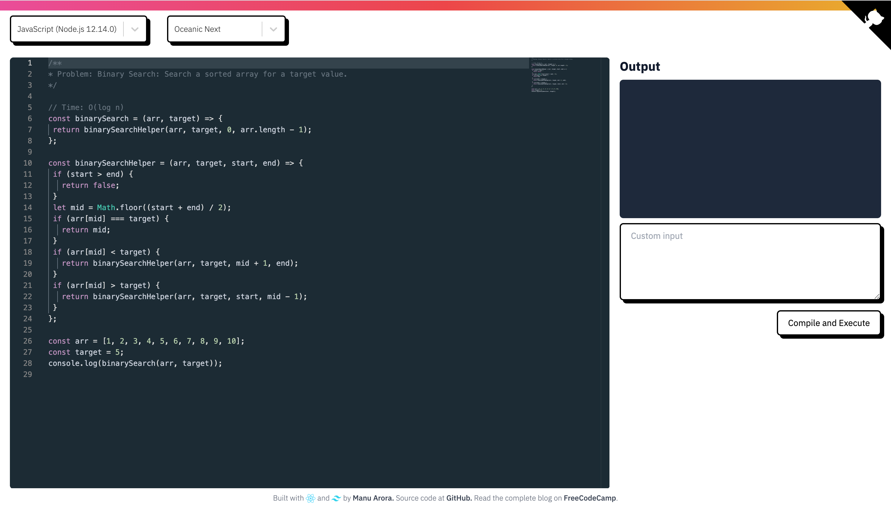

# React Collaborative Code Editor

A real-time collaborative code editor built with React, featuring VS Code-like functionality and multi-user collaboration capabilities.



## Features

### Code Editor

- Monaco Editor integration with VS Code-like experience
- Syntax highlighting for multiple programming languages
- Real-time code compilation and execution
- Customizable editor settings:
  - Font size adjustment
  - Line numbers toggle
  - Word wrap options
  - Minimap visibility
  - Code folding
- VS Code-like keyboard shortcuts
- Multi-cursor support
- Smart bracket pair colorization
- Error and warning indicators

### Real-time Collaboration

- Multi-user simultaneous editing
- Real-time code synchronization
- Remote cursor tracking
- User presence indicators
- Edit activity visualization
- Collaborative session management
- Shareable session links
- User-specific color coding
- Recent changes panel with diff view

### User Interface

- VS Code-inspired design
- Customizable menu bar with:
  - File operations (New, Open, Save, Save As)
  - Edit functions (Undo, Redo, Cut, Copy, Paste)
  - Selection tools
  - View options
- Status bar with editor information
- File type detection
- Responsive layout

## Technologies Used

- **Frontend:**

  - React
  - Monaco Editor (@monaco-editor/react)
  - Socket.IO Client
  - Tailwind CSS

- **Backend:**
  - Node.js
  - Express
  - Socket.IO
  - UUID

## Prerequisites

- Node.js (v14.0.0 or higher)
- npm (v6.0.0 or higher)

## Installation

1. Clone the repository:

   ```bash
   git clone https://github.com/yourusername/react-code-editor.git
   cd react-code-editor
   ```

2. Install dependencies:

   ```bash
   npm install
   ```

3. Create a `.env` file in the root directory:

   ```env
   REACT_APP_API_URL=http://localhost:3001
   PORT=3000
   ```

4. Start the development server:

   ```bash
   npm start
   ```

5. Start the backend server:
   ```bash
   npm run server
   ```

The application will be available at `http://localhost:3000`

## Usage

### Starting a New Session

1. Open the application in your browser
2. Click "New Session" to create a collaborative session
3. Share the generated session URL with collaborators

### Joining a Session

1. Open the shared session URL
2. You will automatically join the collaborative session
3. Your cursor and changes will be visible to other participants

### Editor Controls

- **File Menu:**

  - New File (Ctrl+N)
  - Open File (Ctrl+O)
  - Save (Ctrl+S)
  - Save As (Ctrl+Shift+S)
  - Preferences

- **Edit Menu:**

  - Undo (Ctrl+Z)
  - Redo (Ctrl+Y)
  - Cut (Ctrl+X)
  - Copy (Ctrl+C)
  - Paste (Ctrl+V)
  - Find (Ctrl+F)
  - Replace (Ctrl+H)

- **Selection Menu:**

  - Select All (Ctrl+A)
  - Expand Selection (Shift+Alt+→)
  - Shrink Selection (Shift+Alt+←)
  - Add Cursor Above (Alt+Shift+↑)
  - Add Cursor Below (Alt+Shift+↓)

- **View Menu:**
  - Toggle Word Wrap (Alt+Z)
  - Toggle Minimap
  - Toggle Line Numbers
  - Toggle Code Folding
  - Zoom In (Ctrl++)
  - Zoom Out (Ctrl+-)

### Collaboration Features

- **Cursor Tracking:** See other users' cursors in real-time
- **Edit Highlights:** Visual indicators show where others are editing
- **Changes Panel:** View recent changes with diff information
- **User Colors:** Each user is assigned a unique color for identification

## Development

### Project Structure

```
react-code-editor/
├── src/
│   ├── components/
│   │   ├── CodeEditorWindow.js
│   │   ├── CollaborationPanel.js
│   │   └── ...
│   ├── contexts/
│   │   └── CollaborationContext.js
│   ├── lib/
│   │   └── defineTheme.js
│   ├── constants/
│   │   └── languageOptions.js
│   ├── App.js
│   └── index.js
├── server/
│   └── server.js
└── package.json
```

### Adding New Features

1. Fork the repository
2. Create a feature branch
3. Implement your changes
4. Submit a pull request

## Contributing

Contributions are welcome! Please feel free to submit a Pull Request.

## License

This project is licensed under the MIT License - see the [LICENSE](LICENSE) file for details.

## Acknowledgments

- [Monaco Editor](https://microsoft.github.io/monaco-editor/)
- [Socket.IO](https://socket.io/)
- [React](https://reactjs.org/)
- [Tailwind CSS](https://tailwindcss.com/)

## Support

For support, please open an issue in the GitHub repository or contact the maintainers.

## Authors

- Your Name - Initial work - [YourGitHub](https://github.com/yourusername)

## Roadmap

- [ ] Authentication system
- [ ] Persistent storage for code sessions
- [ ] More language support
- [ ] Custom theme creation
- [ ] Plugin system
- [ ] Mobile responsiveness improvements
